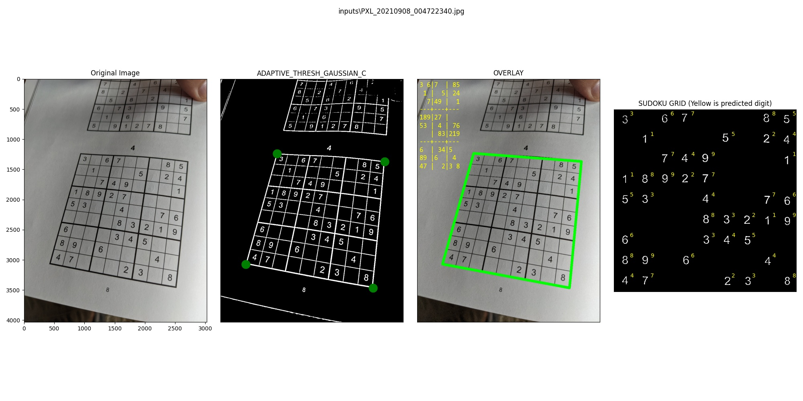

# Sudoku grid detector
 Sudoku grid detection from a mobile phone photo

1. Load Sudoku image
2. Binarize image
3. Find largest quadrilateral contour
4. Generate warped image of grid
5. Remove extraneous lines
6. Match tiles to digits using basic CV template matching
*(TODO) Improve matching with ML-based digit detection*